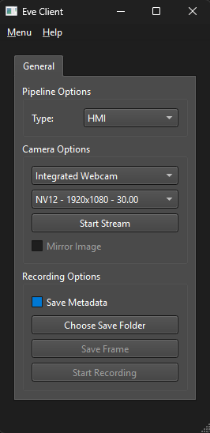
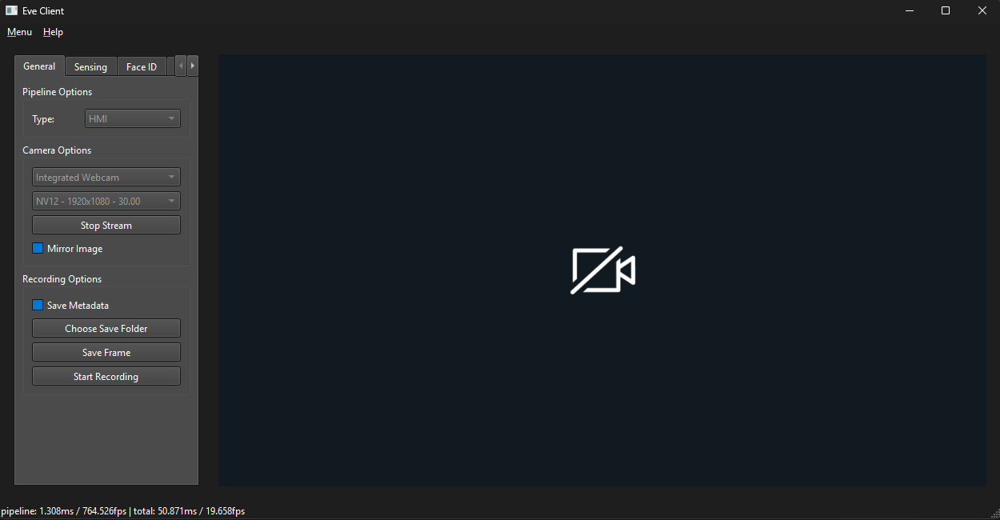
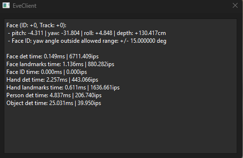
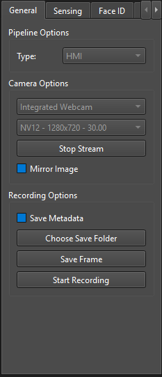
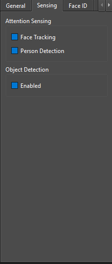
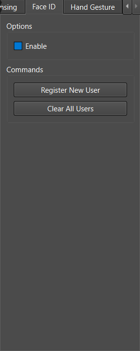
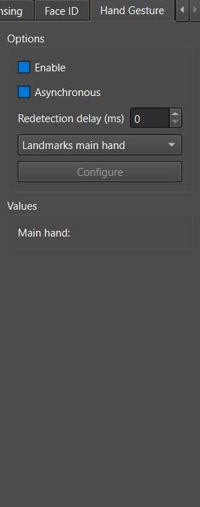
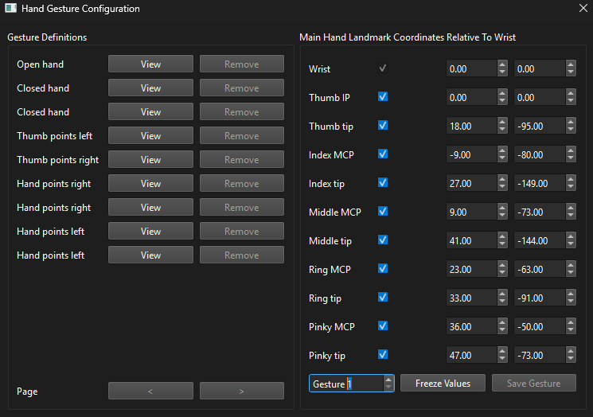

# Lattice sensAI EdgeVisionEngine SDK
The Edge Vision Engine (EVE) software library runs computer vision and AI algorithms on an image to extract data relative to your presence and your environment. EVE uses a combination of central processing unit (CPU) and neural processing unit (NPU) to achieve maximum efficiency. EVE focuses on Human Machine Interface (HMI) algorithms such as tracking your face, computing your distance from the camera, detecting persons and various objects, and more. The data computed by EVE is available to other applications via the EVE Software Development Kit (SDK). EVE can run on Windows and Linux computers (x64), and small devices such as the Raspberry Pi (Linux ARM).

## Hardware Requirements
### Windows PC
- **OS**: Windows 11.
- **CPU**: At least an Intel® i5 processor or AMD® Ryzen™ 5 processor.
- **Memory**: At least 8 GB of RAM.
- **Storage**: At least 1 GB.
- **Camera**: Lenovo® 510 FHD (RGB) camera.

### Linux PC
- **OS**: Ubuntu 25.04 (Plucky Puffin).
- **CPU**: At least an Intel® i5 processor or AMD® Ryzen™ 5 processor.
- **Memory**: At least 8 GB of RAM.
- **Storage**: At least 1 GB.
- **Camera**: Lenovo® 510 FHD (RGB) camera.

### Raspberry Pi 5
- **OS**: Ubuntu 25.04 (Plucky Puffin).
- **CPU**: Raspberry Pi 5 (Broadcom® BCM2712 2.4 GHz quad-core 64-bit Arm® Cortex®-A76).
- **Memory**: At least 8 GB of RAM.
- **Storage**: At least a 32 GB microSD card.
- **Power supply**: 5 A USB-C power supply.
- **Cooling system**: Any active heat sink designed for Raspberry Pi 5.
- **Camera**: Lenovo® 510 FHD (RGB) camera.

## Getting a Product Key
A product key is needed to activate EVE. If you don’t already have a product key, visit this [page](https://huggingface.co/LatticeSemi/sensAI-Edge-Vision-Engine-SDK-Packages) and fill out the form to automatically get a product key for EVE.

## Software Setup
### Installing EVE on Windows
To install EVE on Windows, follow these steps:
1. Download the latest version of the Windows package from our [GitHub](https://github.com/sensAI-Solution/Lattice-sensAI-Edge-Vision-Engine-SDK).
2. Unzip the package into an empty folder.
3. Open File Explorer in the folder where EVE was unzipped.
4. Run `EveAuthenticator` with your product key, using the following command:
```bash
EveAuthenticator.exe -k [key]
```

### Installing EVE on Linux
To install EVE on Linux (PC or Raspberry Pi 5), follow these steps:
1. Download the latest version of the Debian package from our [GitHub](https://github.com/sensAI-Solution/Lattice-sensAI-Edge-Vision-Engine-SDK).
2. Open a terminal, and install the package with the following command:
```bash
sudo apt install ./linux_package_name_x64/ARM.deb
```
3. Go into the directory where EVE was installed:
```bash
cd /opt/EVE-<VERSION>-Source/bin
```
4. Run `EveAuthenticator` with your product key, using the following command:
```bash
./EveAuthenticator -k [key]
```
You should now be able to test EVE by running the `EveClient` program (more details below).

### License Troubleshooting
If you have issues during license, please ensure:
- You are connected to the internet.
- Your computer's date and time are correct.
- Your firewall does not block connections to `wyday.com`.
- Your firewall has whitelisted the `EveClient` and `EveAuthenticator` executables.
- Disconnect from docks.
- Try an alternative ethernet adapter if you still encounter issues activating.

## Features and Applications
### EVE Supported Features
The following table summarizes the features supported by EVE for each pipeline/camera combination.
|Feature|HMI Pipeline - RGB|Full Pipeline - RGB|Full Pipeline - IR|
|:-----:|:----------------:|:-----------------:|:----------------:|
| 3DHP (x, y, z) | No | Yes | Yes |
| 3DHP (pitch, yaw, roll) | Yes | Yes | Yes |
| Face Landmarks | Yes (23) | Yes (68) | Yes (68) |
| Face Indentification | Yes | Yes | No |
| Depth Estimation | Yes | Yes | Yes |
| Person Detection | Yes | Yes | No |
| Object Detection | Yes | Yes | No |
| Hand Landmarks | Yes (10) | Yes (11) | No |
| Hand Static Gesture Classification | Yes | Yes | No |
| Gaze | No | Yes | Yes |
| RoI Selection | No | Yes | Yes |
| Fatigue (Karonlinska) | No | Yes | No |
| Eyewear Detection | No | Yes | No |
| Visual Speech Detection | No | Yes | No |


### EveClient
EveClient is a tool used for developing and testing EVE’s algorithms. It connects to cameras, feeds images to the engine for processing, and receives data to display. It also contains elements to turn features on or off. These features are organized into tabs, which will be explained in detail in the following sections.

> [!NOTE]
> The following section documents the HMI pipeline with an RGB camera.

#### Launching EveClient on Windows
To launch EveClient on Windows, follow these steps:
- Open File Explorer in the directory where EVE was installed.
- Double-click on the `EveClient.exe` file.

#### Launching EveClient on Linux
To launch EveClient on Linux (PC and Raspberry Pi), follow these steps:
- Open a terminal and move into the directory where EVE was installed:
    - `cd /opt/EVE-<VERSION>-Source/bin`
- Launch EveClient:
    - `./EveClient` (Linux PC) or `RUSTICL_ENABLE=v3d ./EveClient` (Linux Raspberry Pi)

#### Launch Window


The parameters of the `EveClient` launch window are as follows:
- **Pipeline Type**: Selects the type of pipeline for EVE to use.
- **Camera:** Selects which camera for EVE to get images from.
- **Encoding/Resolution/FPS**: Selects the encoding, resolution and FPS of the chosen camera.
- **Start Streaming**: Starts the stream and get to the main window of `EveClient`.
- **Choose Save Folder**: Selects the folder on your computer where EVE's data will be saved (metadata, frames and recording).

#### Main Window


The parameters of the `EveClient` main window are as follows:
- **Menu**: Opens EVE’s data view window, which contains additional statistics about individual features such as inference time.
- **Feature Tabs**: Controls EVE’s features and options.
- **Video Panel**: Shows frames that were processed by EVE.
- **Timing Statistics**:
    - **Pipeline Time**: Time taken to compute the activated feature in EVE’s pipeline.
    - **Total Time**: Time taken for the complete cycle of image acquisition and processing.

#### Data View Window


This window shows advanced statistics related to EVE’s features, such as the inference time and the number of inferences per second. Both are a measure of how much time was spent in the network of the associated feature. There is also additional information for face detection and face identification. 

#### General Tab
This tab controls which algorithms are available, as well as the parameters of the images fed to EVE.



The parameters of the `EveClient` general tab are as follows:
- **Pipeline Type**: Selects the type of pipeline for EVE to use. If you want to change the pipeline type, you will have to close `EveClient` and re-open it to change it from the launch window.
- **Camera:** Selects which camera for EVE to get images from. This cannot be changed unless the stream is stopped.
- **Encoding/Resolution/FPS**: Selects the encoding, resolution and FPS of the chosen camera. This cannot be changed unless the stream is stopped.
- **Start/Stop Streaming**:
    - **Start Streaming**: Starts the stream with the specified camera parameters.
    - **Stop Streaming**: Stops the stream.
- **Mirror Image**: Mirrors the displayed image.
- **Save Metadata**: Saves the metadata alongside the frame or recording.
- **Choose Save Folder**: Selects the folder on your computer where EVE's data will be saved (metadata, frames and recording).
- **Save Frame**: Saves the current frame.
- **Start/Stop Recording**:
    - **Start Recording**: Starts the recording. Note that when you are recording, you cannot save any frames.
    - **Stop Recoding**: Stops the recording.

#### Sensing Tab
Sensing features are algorithms related to you, objects, and your attention.



The parameters of the `EveClient` sensing tab are as follows:
- **Face Tracking**: Enables the tracking of faces. For the main user, 23 landmarks are computed and showcased on screen. Depth estimation is also performed for the main user. Secondary users have 5 landmarks computed.
- **Person Detection**: Detects people from the image. A bounding box is drawn around the detected people, with its orientation (frontal or non-frontal) and a confidence score (between 0.0 and 1.0).
- **Object Detection**: Detects objects from the image. A bounding box is drawn around the detected objects, with its class and a confidence score (between 0.0 and 1.0).

#### FaceID Tab
This feature can identify a user against a list of registered users. That list is stored in a gallery file which is updated every time a new user is registered, or all users are removed.



The parameters of the **FaceID** tab are as follows:
- **Enabled**: Starts the identification for the tracked person on screen. The text appears below the detected face of the user, depending on the face identification state.
- **Register New User**: Creates a new entry in the gallery file for the current user. If the pose for the calibration of the user is incorrect, it will be displayed below the detected face of the user. 
- **Clear All Users**: Removes all entries from the gallery.

#### Hand Gesture Tab
This feature can track hands and detect static gestures (main hand only). The detected static gesture is shown under “Values” in the sidebar. Note that hand gesture performs better when the palm is facing the camera.



The parameters for **Hand Gesture** are as follows:
- **Enabled**: Detects the hand(s) with the 10 computed landmarks. A green box is drawn around the main hand, and a yellow box around all other detected hands. Landmarks each have their own color for their expected position.
- **Asynchronous**: Makes the hand detection asynchronous, which results in a lower pipeline time.
- **Redetection delay**: Specifies the delay before running the hand detection network. If left to 0, the hand detection network is run on every frame.
- **Hand Landmarks**: Selects whether hand detection and landmarks are done only for the main hand, or for all hands.
- **Configure**: Opens the following menu that can be used to configure hand gesture.



Here are the parameters of the configuration menu for hand gesture:
- **Gesture Definitions**: Defined static gestures in EVE. By clicking “View” on a gesture, landmark values for the gesture will be updated in the right panel. Custom gestures that were saved will also appear in this panel, and they can be removed by clicking on the “Remove” button. There is a maximum of 10 custom gestures in EVE.
- **Main Hand Landmark Coordinates Relative to Wrist**: Coordinates of the 10 landmarks related to the wrist landmark (0, 0) origin. Clicking on “Freeze Value” will stop the landmarks value from updating, allowing the user to save the gesture by clicking on the “Save Gesture” button at the bottom right. You can unfreeze the values by clicking on “Unfreeze Values” if the landmarks were previously frozen. You can also specify landmarks of your custom gestures by clicking on the corresponding checkbox.

## EVE SDK
The EVE SDK is a C interface used to develop applications that use EVE. You can either make EVE connect to a camera, or send images to EVE for processing, while deciding which features get computed on every frame. Do note that there’s a Python SDK that is available as well (see the `python/` folder in the installed package).

For more information about the EVE SDK data structures and functions, refer to the `docs/` folder.

### EVE SDK Setup
To communicate with EVE, an external application must add the libraries to the project’s dependencies and include EVE’s header files as additional includes in your project.

### EVE SDK Samples
In the installation folder, you will find a `samples/` folder containing two examples (`C++` and `Python`) showcasing person detection and face detection. Please refer to the `README.md` in that folder for more details on how to run them.
